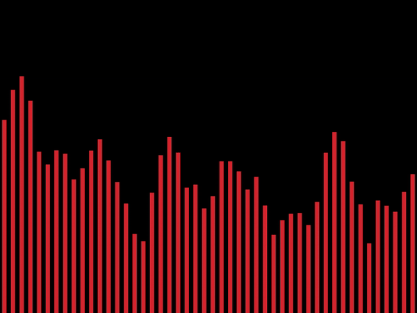

# GLMViz 
A OpenGL music visualizer. GLMViz currently supports FiFo buffers and PulseAudio as input.

The main focus of this project is to create a high framerate, dB correct spectrum audio visualizer.

## Example

More examples are in the [Example folder](examples).

## Build Requirements
GLMViz is NOT a lightweight program as it's build using GLFW and other OpenGL abstraction libraries.
* OpenGL libraries: `libglfw`, `libglm`
* FFT library: `fftw`
* PulseAudio[Optional]: `libpulse`
* Configuration library: `libconfig++`

Additionally CMake 3.0.2 / [Meson](http://www.mesonbuild.com) and a C++11 compatible compiler are needed to successfully build the project.

## Installing
The install script automatically creates a build folder, handles configuration, etc...
Runnig the install script will install GLMViz to `/usr/local/bin/` and copy the default config to `/etc/GLMViz/config`

    ./install

Per-user configurations have to be copied manually using:

    cp /etc/GLMViz/config ~/.config/GLMViz/config

## Usage
    glmviz [path-to-config]

Exit with <kbd>CTRL-C</kbd> or by closing the window.

The config can be reloaded by pressing <kbd>R</kbd> or by sending `SIGUSR1` to the program.

## Thanks
Big thanks to [dpayne](https://github.com/dpayne/) and [Karl Stavestrand](https://github.com/karlstav) for the pulseaudio setup code.
Also thanks to [xdaimon](https://github.com/xdaimon) and [kritzikratzi](https://github.com/kritzikratzi) for the smooth line shader idea.
